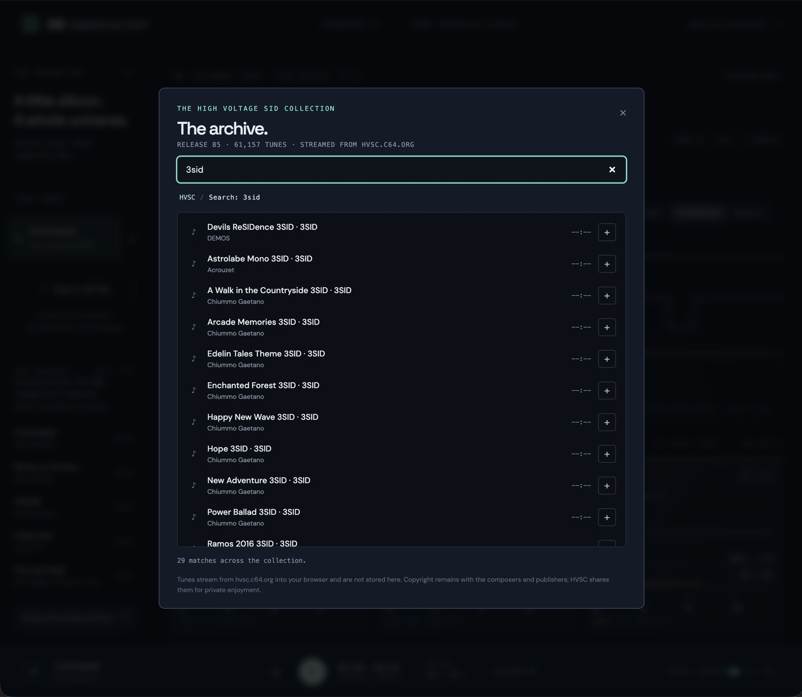

# SID Observatory

A browser player and live voice inspector for Commodore 64 SID music. It plays PSID files for one, two or three SID chips, streams tunes from the High Voltage SID Collection, and shows what each voice, envelope and filter is doing while the music plays.

Live demo: https://nutmeg-cairn-grwh.here.now/


It is a static site with no build step, no backend and no npm dependencies. Everything runs in the browser: the emulator, the inspector and the archive browser.

## Features

**Playback**

- PSID v1 to v4 files, PAL, with subtune selection, pause, restart and volume.
- 2SID and 3SID tunes: up to three chips and nine voices, one filter per chip.
- 6581 or 8580 emulation chosen per chip, defaulting to the model the file declares.
- Mute and solo per voice. Oscillator and envelope emulation continue while a voice is muted, so the readouts stay live.
- Song lengths from the HVSC database, an elapsed/length display, and **Continue** to play on to the next tune when one ends.
- Space toggles playback when no control has focus.

**Inspector**

- A card per voice with frequency, nearest equal-tempered note, pulse width, ADSR nibbles, gate/sync/ring/test flags, the waveform and an envelope meter.
- A filter strip per chip with mode, cutoff register, resonance and routing.
- A hex register view, one block per chip.
- Two layouts for multi-chip tunes, remembered in the browser: **Compact** shows every chip as a row of condensed cards, **Tabs** shows one chip at a time at full size.


**Visualizations**

- Phosphor mode maps each voice's pre-filter waveform onto a glowing radial orbit with a short fading history. Extra chips nest inside the first chip's orbits as smaller rings.
- Oscilloscope mode shows triggered time-domain traces, one band per chip.
- Listening mode hides the instrument panel and gives the visualization the whole window.
- Reduced motion is honoured: orbit rotation and history trails are removed, the geometry stays.


**The archive**

- A starter shelf of verified classics, from Hubbard and Galway to modern 2SID and 3SID work.
- A browser over the whole High Voltage SID Collection: folder tree, search across every composer and title, per-subtune lengths.
- Tunes are fetched from hvsc.c64.org directly into the browser when you choose them. The site stores nothing.
- Each archive tune links to DeepSID for a reference listen.
- Your own `.sid` files can be opened with the file picker or dropped anywhere on the page. They stay in browser memory and are never uploaded.



## Quick start

Requirements: Python 3 for the local static server, Node.js 20 or later for the tests. There is nothing to install.

```sh
git clone https://github.com/DWestbury-PP/sid-observatory.git
cd sid-observatory
npm run serve
```

Open http://127.0.0.1:8080, pick a tune from the shelf or the archive, and press Play.

Two things to know when running locally:

- Use `127.0.0.1`, not `localhost`. hvsc.c64.org sends `Access-Control-Allow-Origin: *` to every origin except `http://localhost`, so archive fetches fail from a `localhost` page. The app shows a hint if this happens.
- The page must be served, not opened as a file. AudioWorklet needs a secure context, which `127.0.0.1` and any https origin provide.

Run the tests with:

```sh
npm test
```

## Deploying

The site is the contents of `dist/`. Copy that directory to any static host that serves over https and it works as-is; there is no server-side component.

A publish script for [here.now](https://here.now/) is included. It reads `HERE_NOW_API_KEY` from the environment or from a `.env` file, which is gitignored.

```sh
python3 scripts/publish-herenow.py          # create a new site on a fresh slug
python3 scripts/publish-herenow.py <slug>   # update an existing site in place
```

The script stamps the `?v=` cache-busters in `index.html` with the package version and the current commit at publish time, so a deploy invalidates cached scripts and styles. The source file is not modified.

## How it works

**Emulation.** The engine is Hermit's jsSID 0.9.1, a small JavaScript SID and 6502 emulator. It is kept unmodified under `dist/vendor/jssid.js`. A Python script, `scripts/adapt-engine.py`, applies a reproducible patch and writes `dist/vendor/sid-core.js`, which runs as a strict ES module inside an AudioWorklet. The patch adds per-voice sample and envelope taps for the inspector, bounded CPU execution so a malformed file cannot hang the audio thread, an ENV3 index fix, multi-chip loading from the PSID header, and per-chip model application. Upstream already emulated three chips but applied the first chip's filter and combined-waveform model everywhere.

**Audio thread.** `dist/sid-worklet.js` hosts the core in an AudioWorkletProcessor. It renders audio and, about fifty times a second, posts a snapshot to the main thread: register bytes for each chip, internal envelope counters and a short pre-filter waveform window per voice. The main thread never touches the emulator directly.

**File parsing.** `dist/sid-format.js` validates the PSID header before anything reaches the emulator. It reads the load, init and play addresses, subtune count, clock and model flags, and for v3 and v4 files the second and third chip addresses. Odd or reserved address bytes mean "no chip", and unknown model bits on chips 2 and 3 inherit chip 1, as the HVSC specification describes. RSID, NTSC-only, PlaySID-specific and interrupt-vector files are rejected with a clear message.

**Interface.** `dist/app.js` owns the collection, the transport, the inspector and the archive dialog. It rebuilds the inspector per tune from the chip count in the header. `dist/visualizations.js` holds the two canvas renderers and `dist/collection.js` the track-removal state transitions, both as pure functions so they can be tested without a browser.

**Archive index.** HVSC publishes `DOCUMENTS/Songlengths.md5`, a file listing every tune in the collection with the length of each subtune. `scripts/build-hvsc-index.py` turns it into a small static index under `dist/hvsc/`: a manifest, one JSON shard per second-level folder for the tree view, a plain path list for search, and the starter shelf, whose entries are fetched and checked against their PSID headers at build time. The index is committed and pinned to one HVSC release so the site behaves the same for everyone until it is deliberately regenerated. The browser loads a shard only when you open that folder.

Preferences, currently the inspector layout and the Continue toggle, are kept in `localStorage`. Nothing else persists. Google Fonts is the only third-party resource other than the archive itself, and there are local font fallbacks.

## Regenerating derived files

Three files in the repository are generated. Regenerate them after changing the scripts that produce them, then run the tests.

```sh
python3 scripts/adapt-engine.py       # dist/vendor/sid-core.js from dist/vendor/jssid.js
python3 scripts/make-demo.py          # tests/music/*.sid, the original test fixtures
python3 scripts/build-hvsc-index.py   # dist/hvsc/, downloads Songlengths.md5 (network)
npm test
```

`build-hvsc-index.py --from FILE` reuses a local copy of `Songlengths.md5`. The test suite checks that the committed index is internally consistent and that every shelf entry exists in it.

## Limitations

This is a lightweight player with an inspector attached, not a cycle-exact reference emulator.

- RSID, NTSC-only tunes, MUS and PlaySID-specific files and tunes that play from an interrupt vector are rejected. PAL is assumed when a file does not specify a clock.
- Digis, ROM-dependent players and unusual CIA timing are outside what jsSID emulates and may fail or sound wrong. See the upstream notes in `dist/vendor/README-jsSID.txt`.
- Multi-SID playback has been exercised with real 2SID and 3SID tunes from HVSC, but its fidelity has not been compared against a reference emulator.
- The inspector samples emulated state at 50 Hz. It is not a log of every register write and can miss changes between snapshots. Visuals can lead the sound by the audio output latency.
- Envelope meters read the emulator's internal counters. Real hardware exposes only ENV3.
- ADSR fields are raw 4-bit values. Cutoff is the 11-bit register value, not a frequency in Hz. Noise voices show their oscillator frequency word, not a perceived pitch. Pulse width is the register fraction of 4096.
- Mute and solo act at the filter input, so muting a voice also changes what the shared filter is fed.

## Project layout

```
dist/                     the deployable site
  index.html, style.css   markup and styles
  app.js                  main-thread controller: collection, transport, inspector, archive dialog
  sid-format.js           PSID validation and metadata, including v3/v4 chip addresses and models
  sid-worklet.js          AudioWorklet processor and snapshot bridge
  visualizations.js       phosphor and oscilloscope renderers
  collection.js           track-removal state transitions
  archive.js              HVSC URL, shard, search, length and auto-advance helpers
  hvsc/                   generated HVSC index, pinned to one release
  vendor/jssid.js         Hermit's jsSID 0.9.1, unmodified, with its README
  vendor/sid-core.js      generated AudioWorklet core
scripts/
  adapt-engine.py         reproducible patch that produces vendor/sid-core.js
  make-demo.py            6502 assembler and PSID writer for the test fixtures
  build-hvsc-index.py     builds dist/hvsc/ from HVSC's Songlengths database
  publish-herenow.py      publishes dist/ to here.now
tests/
  *.test.js               node --test suites: format, playback, worklet bridge, multi-SID, interface, archive
  music/                  two original PSID fixtures, single-chip and 3SID
docs/images/              README screenshots
```

Release notes are in [CHANGELOG.md](CHANGELOG.md).

## Roadmap

- Named playlists, saved in the browser as HVSC paths.
- STIL commentary alongside each archive tune.
- Fidelity comparison against a reference emulator, and RSID support if the engine can carry it.

## Credits and licensing

The emulator is **jsSID 0.9.1 by Mihaly Horvath (Hermit), 2016**, mirrored at https://github.com/og2t/jsSID. Hermit released it under a "do what you want" licence and asked that the credits stay; both the original and the adapted core are distributed here with `dist/vendor/README-jsSID.txt` intact.

Archive tunes come from the [High Voltage SID Collection](https://www.hvsc.c64.org/). They remain the copyright of their composers and publishers, and HVSC distributes them for private enjoyment only. This repository does not contain or redistribute any HVSC file; the browser fetches each tune from hvsc.c64.org when a listener asks for it. The two fixtures under `tests/music/` are original compositions written for the test suite.

The interface, adapter, scripts, tests and fixtures were written for this project. A licence for that code has not been chosen yet.

References: HVSC `DOCUMENTS/SID_file_format.txt` and the [VICE manual](https://vice-emu.sourceforge.io/vice_17.html) for the SID format; [DeepSID](https://deepsid.chordian.net/) as a reference player; [here.now docs](https://here.now/docs) for hosting.
