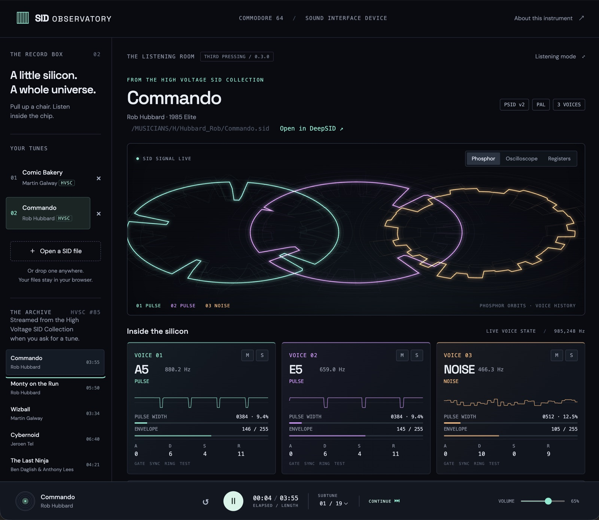
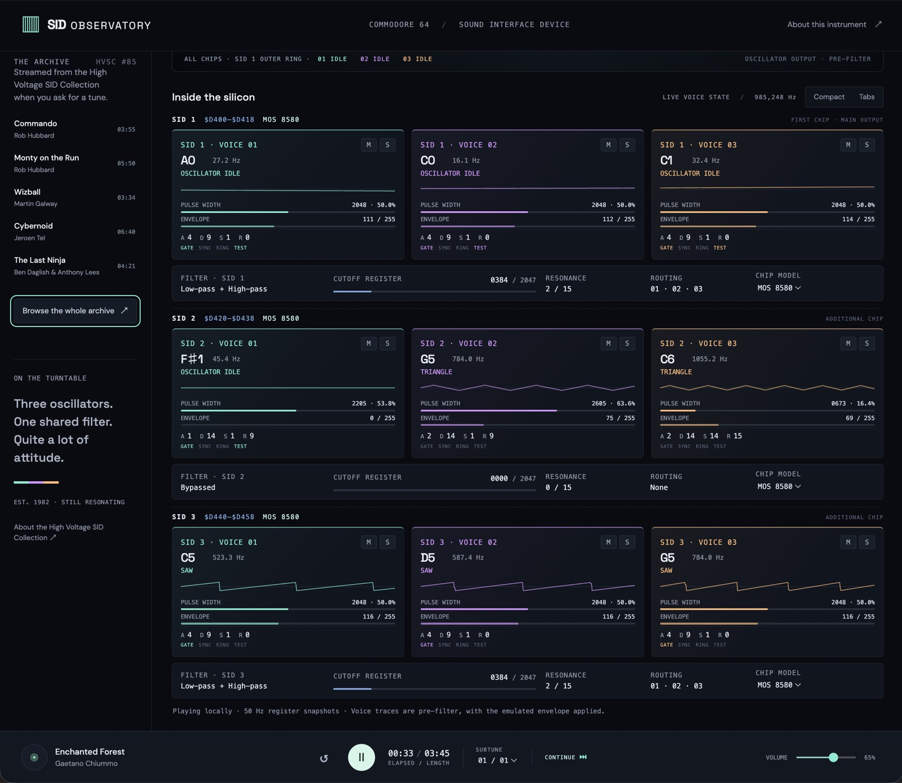
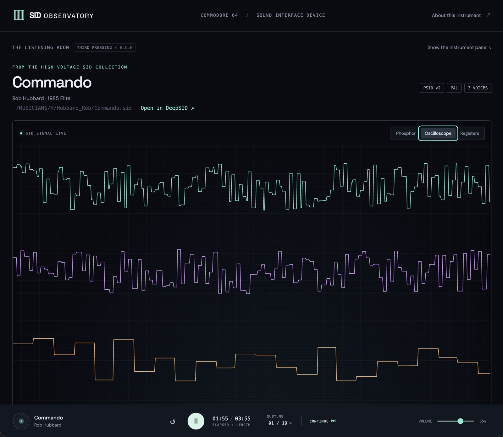

# SID Observatory

A browser SID listening room: demoscene phosphor meets a modern instrument panel.

## Live demo: https://nutmeg-cairn-grwh.here.now/





### Archive update (0.3.0)

The record box now opens onto the High Voltage SID Collection (HVSC). A starter shelf of verified classics sits in the sidebar, and **Browse the whole archive** opens a dialog with the full folder tree and a search box over every composer and title. Choosing a tune fetches it from `hvsc.c64.org` straight into the browser (the download host sends `Access-Control-Allow-Origin: *`), parses it with the same strict PSID gate as a local file, and adds it to your tunes with its song length. Nothing is stored by the site or committed to this repository; the tunes remain the copyright of their composers and publishers, and HVSC distributes them for private enjoyment.

The browsable index is generated, committed and pinned to one HVSC release by `scripts/build-hvsc-index.py`, which reads HVSC's own `Songlengths.md5`: a manifest, one JSON shard per second-level folder, a path list for search, and a starter shelf whose entries are verified against their PSID headers at build time. The transport shows elapsed time against the song length, and **Continue** plays on to the next tune in the collection when one ends. No music is bundled: the record box starts empty and fills from the shelf, the archive or your own files. Each HVSC tune links out to DeepSID for a reference listen.


### Multi-SID update (0.2.0)

2SID and 3SID tunes (PSID v3/v4) now play. The parser reads the second and third chip addresses and per-chip model bits exactly as the HVSC specification describes: odd or reserved address bytes mean "no chip", and unknown model bits for chips 2 and 3 inherit chip 1. The adapted jsSID core drives up to three chips, nine voices and one filter per chip; upstream parsed per-chip models but applied the first chip's model everywhere, and the adapter patch corrects that. Each chip has its own model selector, seeded from the file.

The inspector rebuilds per tune. Single-chip tunes keep the classic three-card row. Multi-chip tunes offer two layouts, switchable and remembered in the browser: **Compact** shows every chip as a row of condensed cards with fixed row heights, and **Tabs** shows one chip at a time at full size. The register view shows one block per chip. Phosphor mode nests extra chips as smaller rings inside the first chip's orbits; oscilloscope mode gives each chip its own band. An original three-chip canon, `Phosphor dreams 3SID`, with mixed 8580/6581/8580 models exercises all nine voices in the test suite.



### Collection and visualization update (0.1.2)

Imported tracks have a separate remove button. The two visualization modes now use distinct geometry, including when the operating system requests reduced motion.

### Layout update (0.1.1)

The application now uses the available dynamic viewport height. Header and playback controls have dedicated layout rows, with a scrollable workspace between them. Wide, shorter windows use a smaller main display and tighter spacing. Content remains reachable when browser chrome, window resizing or text enlargement reduces the available space.

Voice cards use explicit, stable row heights for pitch, combined-waveform labels, scopes and numeric readouts. Changing live values cannot grow a card. Full combined-waveform and filter labels are available on hover if space is limited.

## Run

Requires Python 3 for the local static server and Node.js 20+ for tests. No npm dependencies or build step.

```sh
npm run serve
# Open http://127.0.0.1:8080 and press Play.
npm test
```

Use `127.0.0.1` rather than `localhost` for local development: hvsc.c64.org sends `Access-Control-Allow-Origin: *` to every origin except `http://localhost`, so archive fetches fail from a `localhost` page. The published https site is unaffected.

Serve over HTTPS in production: AudioWorklet requires a secure context. Publish the contents of `dist/` to here.now or another static host. Opening index.html as a file will not work.

```sh
python3 scripts/publish-herenow.py          # new preview Site on a fresh slug
python3 scripts/publish-herenow.py <slug>   # update the live Site in place
```

The script reads `HERE_NOW_API_KEY` from the environment or `.env` (never committed).

## What works

- Local file selection, drag-and-drop and removal of imported tracks. Removing the playing track stops it and selects the nearest remaining tune, paused. Removing another track preserves playback. Original files on disk are unchanged.
- PAL PSID playback for one, two or three SID chips, subtunes, pause/resume, restart and volume.
- Hermit's jsSID 0.9.1 adapted to AudioWorklet, with 6581/8580 model selection per chip.
- Emulator-derived pre-filter voice waveforms and internal envelope levels.
- Frequency, nearest equal-tempered note (A4=440), raw pulse-width register / 4096, ADSR nibbles, gate/sync/ring/test flags.
- Mute and solo at the mixer/filter input; oscillator and envelope emulation continue.
- Per-chip filter mode, cutoff register, resonance, routing and hex register view.
- Compact and tabbed inspector layouts for multi-chip tunes; mute and solo across up to nine voices.
- Phosphor visualization, oscilloscope mode, listening mode and reduced-motion support.
- HVSC starter shelf, folder browser and search; tunes streamed on demand with song lengths, elapsed/length display, stop-at-end and auto-advance.
- Responsive layout, keyboard controls (Space toggles playback), accessible control labels.



Imported and streamed tunes remain in browser memory. No tune upload, persistent storage, analytics or backend. Google Fonts is the only external display resource and has local font fallbacks; archive tunes are fetched from hvsc.c64.org only when you choose them. Layout and auto-advance preferences are kept in `localStorage`. DeepSID, HVSC and emulator links are optional external navigation.

## Accuracy and compatibility boundaries

This is an instrumented prototype, not a cycle-exact reference player. It intentionally rejects RSID, NTSC-only tunes, MUS/PlaySID-specific files and interrupt-vector playback (zero play address). Multi-SID fidelity depends on jsSID's lightweight chip model and has not been compared against a reference emulator. ROM-dependent tunes, digis and unusual interrupt timing are not supported by this engine and may fail or sound wrong. PAL is assumed if a file does not specify a clock. See the upstream README for its limitations.

The 50 Hz inspector samples emulated state; it is not a complete history of all SID writes and can miss changes between snapshots. Visual state may lead audible output by device buffering latency. Voice waveforms contain oscillator output multiplied by the emulated envelope before routing through the shared filter. Phosphor mode maps the samples radially into three glowing orbits with short waveform-history trails and slow rotation driven by playback time. Oscilloscope mode shows triggered, flat time-domain traces. Reduced-motion mode removes orbit rotation and history trails while retaining the distinct radial geometry.

Envelope meters are internal emulator counters, not hardware-readable per-voice registers: real SID hardware exposes ENV3 only. ADSR fields show raw 4-bit values; cutoff shows an 11-bit register rather than an estimated Hz value. Noise voices display their oscillator frequency word as Hz, not perceived musical pitch. Pulse percentage is the threshold fraction of 4096; it is not labeled as high-time duty cycle. Mute/solo changes shared-filter excitation, so summing isolated renders need not reproduce the full nonlinear/filter behavior.

## Structure

- `dist/index.html`, `style.css`, `app.js`: interface and main-thread audio controller.
- `tests/music/`: the two original PSID studies used as test fixtures (not published).
- `docs/images/`: README screenshots.
- `dist/sid-format.js`: PSID validation and metadata parsing, including v3/v4 chip addresses and models.
- `dist/collection.js`: deterministic track-removal state transitions.
- `dist/archive.js`: HVSC URL, shard, search, length and auto-advance helpers.
- `dist/hvsc/`: generated index (manifest, shards, path list, starter shelf) pinned to one HVSC release.
- `dist/visualizations.js`: separate oscilloscope and phosphor renderers.
- `dist/sid-worklet.js`: realtime render and instrument snapshot bridge.
- `dist/vendor/jssid.js`: unchanged upstream emulator.
- `dist/vendor/sid-core.js`: generated AudioWorklet-friendly, instrumented emulator core.
- `scripts/adapt-engine.py`: reproducible patch, including explicit-load-address handling in the wrapper, bounded CPU execution, ENV3 index correction, multi-chip loading and per-chip model application.
- `scripts/make-demo.py`: original 6502 music routine and PSID generator for the single-chip and 3SID test fixtures under `tests/music/`.
- `scripts/build-hvsc-index.py`: downloads HVSC's Songlengths database and emits the index under `dist/hvsc/`.
- `scripts/publish-herenow.py`: publishes `dist/` to here.now.
- `tests/player.test.js`: format validation, audio output, restart, mute/model and worklet-bridge tests.
- `tests/multisid.test.js`: chip-address rules, nine-voice rendering, per-chip mute/model and the nine-trace worklet bridge.
- `tests/archive.test.js`: index consistency, shard lookups, shelf verification, URL/search/length helpers and end detection.

To regenerate the derived files:

```sh
python3 scripts/adapt-engine.py
python3 scripts/make-demo.py
python3 scripts/build-hvsc-index.py   # network: refreshes dist/hvsc to the current HVSC release
npm test
```

## Next iteration

Compare playback of familiar HVSC tunes against DeepSID and a reference emulator; evaluate reSID/WebSID fidelity and complete register-write capture. Add named playlist collections (saved as HVSC paths in the browser), STIL commentary per tune, and RSID support once the engine can carry it.

## Credits

Emulator: **Mihaly Horvath (Hermit), 2016**, jsSID 0.9.1, mirrored at https://github.com/og2t/jsSID. Original source blob: `552a05f94353160158a485852629b43107c41c96`. The author's licensing statement is preserved in `dist/vendor/README-jsSID.txt`; it allows use/modification under the author's “WTF license” statement. Original and adapted sources are distributed together. No music is bundled with the site; the original studies live under `tests/music/` as fixtures.

The visual interface, adapter, tests and included procedural composition were created for this project. A project-level license has not yet been chosen by the repository owner.

References: https://vice-emu.sourceforge.io/vice_17.html and HVSC `DOCUMENTS/SID_file_format.txt` (SID format); https://www.hvsc.c64.org/ (archive, Songlengths database, disclaimer); https://deepsid.chordian.net/ (reference player); https://here.now/docs (hosting).
